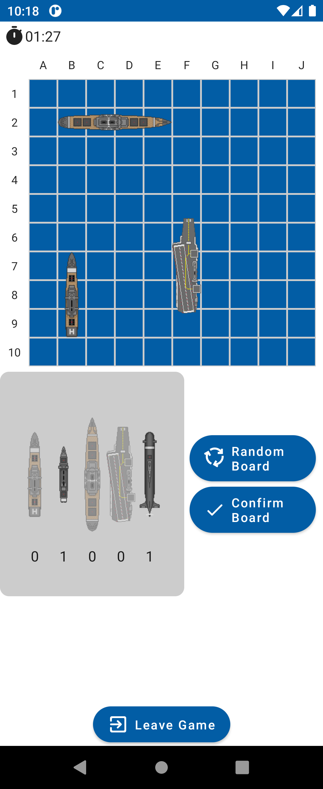
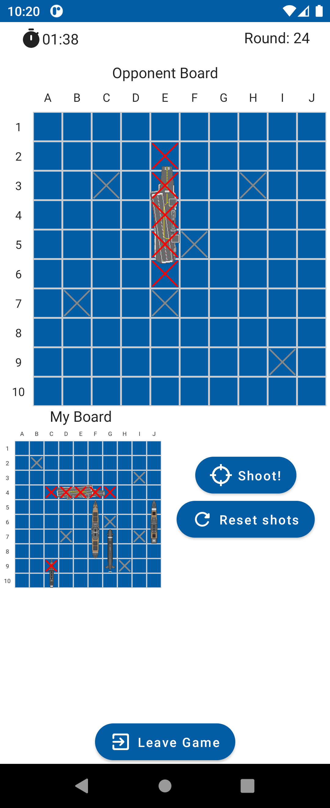

# battleships ⚓

> Battleship game in Android.

    

This is a simple battleship game for Android. The game is multiplayer and each player plays on a
different device.

You need to be logged in to play the game.

The application has the following features:

* Login and Registration
* Ranking of players
* Quick Game
* Custom Game

    
    
    

The application is implemented using Android with Kotlin. It is a client-server application, where
the server is implemented in Kotlin using the Spring framework.

---

## Authors

- 48089 [André Páscoa](https://github.com/devandrepascoa)
- 48280 [André Jesus](https://github.com/andre-j3sus)
- 48287 [Nyckollas Brandão](https://github.com/Nyckoka)

Professor: Eng. Paulo Pereira

@ISEL 
Bachelor in Computer Science and Computer Engineering 
Mobile Devices Programming - LEIC51D - Group 13 
Winter Semester of 2022/2023
